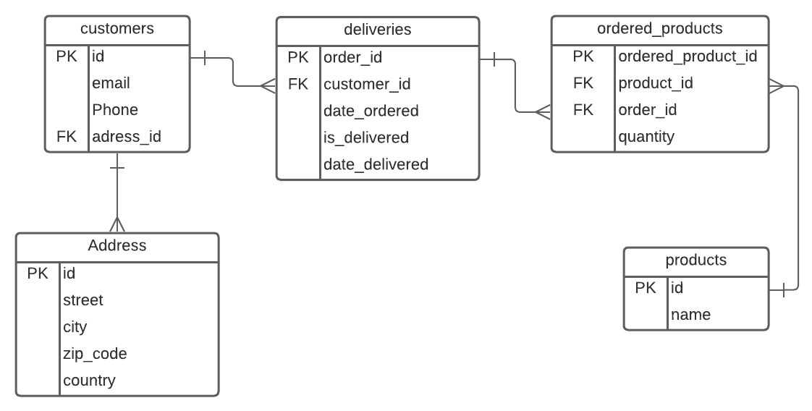

# Exam - Enterprise 1, PG5100

## Description
This is a REST API for managing orders for delivery service, for a grocery store. 

###Security

The routes are secured with Spring Security, using authority based access control. The roles, `ADMIN` and `USER` grants a set of access privileges.

###Functionality
* A non registered user should be able to:
  * register a new user account with`USER`role
  * login with user account
* A logged in account with`USER`or`USER`authority should be able to:
  * fetch all deliveries and users 
  * fetch user by id and email
  * fetch delivery by id
  * update ordered products in existing deliveries
  * delete deliveries
* A logged in account with`ADMIN`authority should be able to:
  * grant authority to user accounts
  * register new authorities
  * fetch all authorities

### Database
The data is stored in a PostgreSQL database, and with Spring data JPA/Hibernate for data access.

## Login instructions

POST `http://localhost:8080/api/login`


Login with admin test account, with params in body as Raw Json
```
{
    "username": "admin@admin.com",
    "password": "pirate"
}
```

Login with user test account as user, with params in body as Raw Json
```
{
    "username": "user@user.com",
    "password": "pirate"
}
```

# API endpoint documentation
## Delivery
### Get all deliveries

| Method | URL                 | Params        | Return value                   |
|--------|---------------------|---------------|--------------------------------|
| GET    | `/api/delivery/all` | none          | JSON array of delivery objects |

Returns an array of all deliveries. If no delivery is found, returns an empty array.

Example request:

`http://localhost:8080/api/delivery/all`

Returns:
```
[
    {
        "orderId": 1,
        "orderDate": "2022-08-10T00:00:00",
        "deliveredDate": null,
        "isDelivered": false,
        "customer": {
            "id": 1,
            "email": "customer1@gmail.com",
            "phone": "90909090",
            "address": {
                "addressId": 1,
                "street": "Street 1",
                "zipCode": "0101",
                "city": "Oslo",
                "country": "Norway"
            }
        },
        "orderedProducts": [
            {
                "orderedProductId": 2,
                "product": {
                    "id": 2,
                    "name": "sugar"
                },
                "quantity": 9
            },
            {
                "orderedProductId": 1,
                "product": {
                    "id": 3,
                    "name": "apple"
                },
                "quantity": 999
            }
        ]
    },
    ...
```

### Get delivery by id
| Method | URL                 | Params                   | Return value           |
|--------|---------------------|--------------------------|------------------------|
| GET    | `/api/delivery/:id` | PathVariable: `id`: Long | A JSON delivery object |

Returns a delivery object. If no match, returns no content.

Example request:

`http://localhost:8080/api/delivery/1`

Returns:
```
    {
        "orderId": 1,
        "orderDate": "2022-08-10T00:00:00",
        "deliveredDate": null,
        "isDelivered": false,
        "customer": {
            "id": 1,
            "email": "customer1@gmail.com",
            "phone": "90909090",
            "address": {
                "addressId": 1,
                "street": "Street 1",
                "zipCode": "0101",
                "city": "Oslo",
                "country": "Norway"
            }
        },
        "orderedProducts": [
            {
                "orderedProductId": 2,
                "product": {
                    "id": 2,
                    "name": "sugar"
                },
                "quantity": 9
            },
            {
                "orderedProductId": 1,
                "product": {
                    "id": 3,
                    "name": "apple"
                },
                "quantity": 999
            }
        ]
```
### Register new delivery
| Method | URL                 | Params                   | Return value                              |
|--------|---------------------|--------------------------|-------------------------------------------|
| POST   | `/api/delivery/new` | Body params: deliveryDTO | A JSON of the registered delivery objects |


Example request:

`http://localhost:8080/api/delivery/1`

With body params: deliveryDTO
```
{
    "customerId": 1,
    "orderedProductsDTO": [
        {
            "productId": 1,
            "quantity": 11
        },
        {
            "productId": 2,
            "quantity": 22
        }

    ]   
}
```


Returns:
```
{
    "orderId": 3,
    "orderDate": "2022-08-10T02:48:42.48594",
    "deliveredDate": null,
    "isDelivered": false,
    "customer": {
        "id": 1,
        "email": "customer1@gmail.com",
        "phone": "90909090",
        "address": {
            "addressId": 1,
            "street": "Street 1",
            "zipCode": "0101",
            "city": "Oslo",
            "country": "Norway"
        }
    },
    "orderedProducts": [
        {
            "orderedProductId": 5,
            "product": {
                "id": 1,
                "name": "milk"
            },
            "quantity": 11
        },
        {
            "orderedProductId": 6,
            "product": {
                "id": 2,
                "name": "sugar"
            },
            "quantity": 22
        }
    ]
}
```
### Update ordered product in existing delivery
| Method | URL                                                     | Params                                                                                | Return value                                 |
|--------|---------------------------------------------------------|---------------------------------------------------------------------------------------|----------------------------------------------|
| PUT    | `/api/delivery/update/orderedProduct/:orderedProductId` | PathVariable: `orderedProductId`: Long<br>Body params: productId: Long, quantity: Int | A JSON object of the updated ordered product |


Example request:

`http://localhost:8080/api/orderedProduct/1`

With body params:
```
        {
            "productId": 3,
            "quantity": 999
        }
```


Returns:
```
{
    "orderedProductId": 1,
    "product": {
        "id": 3,
        "name": "apple"
    },
    "quantity": 999
}
```
### Delete delivery
| Method | URL                        | Params                                  | Return value |
|--------|----------------------------|-----------------------------------------|--------------|
| DELETE | `/api/delivery/delete/:id` | PathVariable: `orderedProductId: Long`  | No content   |
Deletes the delivery with the matching id

Example request:

`http://localhost:8080/api/delivery/delete/2`

## Registration of new user
| Method | URL            | Params                                           | Return value                        |
|--------|----------------|--------------------------------------------------|-------------------------------------|
| POST   | `/api/register` | Body params:<br> email : String, password: String | JSON object of the new user account |

Creates a user with USER authority


Example request:

`http://localhost:8080/api/register`

With body params:
```
{
    "email": "new@new.com",
    "password": "pw"
}
```

Returns:
```
{
    "userId": 3,
    "email": "new@new.com",
    "created": "2022-08-10T03:42:25.056332",
    "password": "$2a$10$0.AabVJwbQaVSoDKO8GwiegHP.NNxq4kym6/36mqSP8sxlAvTQBTu",
    "enabled": true,
    "authorities": [
        {
            "id": 1,
            "name": "USER"
        }
    ]
}
```

## Login
| Method | URL         | Params                                               | Return value |
|--------|-------------|------------------------------------------------------|--------------|
| POST   | `/api/login` | Body params:<br> username : String, password: String | No content   |

Example request:

`http://localhost:8080/api/login`

With body params:
```
{
    "username": "admin@admin.com",
    "password": "pirate"
}
```

Returns:
```
{
    "userId": 3,
    "email": "new@new.com",
    "created": "2022-08-10T03:42:25.056332",
    "password": "$2a$10$0.AabVJwbQaVSoDKO8GwiegHP.NNxq4kym6/36mqSP8sxlAvTQBTu",
    "enabled": true,
    "authorities": [
        {
            "id": 1,
            "name": "USER"
        }
    ]
}
```

## Authority
### Fetch all authorities

| Method | URL                  | Params        | Return value         |
|--------|----------------------|---------------|----------------------|
| GET    | `/api/authority/all` | none          | array of authorities |

Example request:

`http://localhost:8080/api/all`

Returns:
```
[
    "ADMIN",
    "USER",
]

```

### Register new authority
| Method | URL                     | Params                     | Return value                        |
|--------|-------------------------|----------------------------|-------------------------------------|
| POST   | `/api/authority/create` | Body params: name : String | JSON object of registered authority |

Example request:

`http://localhost:8080/api/authority/create`

With body params:
```
{
  "name": "SUPER"
}
```

Returns:
```
{
    "id": 3,
    "name": "SUPER"
}
```

### Grant authority to user
| Method | URL                        | Params                             | Return value |
|--------|----------------------------|------------------------------------|--------------|
| POST   | `/api/authority/addToUser` | Body params: name : addToUser(DTO) | No content   |

Example request:

`http://localhost:8080/api/authority/addToUser`

With body params:
```
{
    "email": "admin@admin.com",
    "authority": "SUPER"
}
```


## User
### Fetch all users

| Method | URL             | Params        | Return value               |
|--------|-----------------|---------------|----------------------------|
| GET    | `/api/user/all` | none          | JSON array of user objects |

Returns an array of all users. If no users is found, returns an empty array.

Example request: 

`http://localhost:8080/api/user/all`

Returns:
```
[
    {
        "userId": 1,
        "email": "admin@admin.com",
        "created": "2022-08-10T03:30:56.69485",
        "password": "$2a$12$aJZigio5thHN4luSrVcQ3enLErI74CDaHqHANgoW69B8ru5uOUCrW",
        "enabled": true,
        "authorities": [
            {
                "id": 1,
                "name": "ADMIN"
            },
            {
                "id": 2,
                "name": "USER"
            }
        ]
    },
    ...
]
```

### Fetch users by id
| Method | URL             | Params                   | Return value                             |
|--------|-----------------|--------------------------|------------------------------------------|
| GET    | `/api/user/:id` | PathVariable: `id`: Long | JSON object of the user with matching id |


Example request:

`http://localhost:8080/api/user/1`

Returns:
```
[
    {
        "userId": 1,
        "email": "admin@admin.com",
        "created": "2022-08-10T03:30:56.69485",
        "password": "$2a$12$aJZigio5thHN4luSrVcQ3enLErI74CDaHqHANgoW69B8ru5uOUCrW",
        "enabled": true,
        "authorities": [
            {
                "id": 1,
                "name": "ADMIN"
            },
            {
                "id": 2,
                "name": "USER"
            }
        ]
    },
    ...
]
```
### Fetch user by email
| Method | URL                     | Params                        | Return value                                |
|--------|-------------------------|-------------------------------|---------------------------------------------|
| GET    | `/api/user/email/:email | PathVariable: `email`: String | JSON object of the user with matching email |


Example request:

`http://localhost:8080/api/user/email/admin@admin.com`

Returns:
```
[
    {
        "userId": 1,
        "email": "admin@admin.com",
        "created": "2022-08-10T03:30:56.69485",
        "password": "$2a$12$aJZigio5thHN4luSrVcQ3enLErI74CDaHqHANgoW69B8ru5uOUCrW",
        "enabled": true,
        "authorities": [
            {
                "id": 1,
                "name": "ADMIN"
            },
            {
                "id": 2,
                "name": "USER"
            }
        ]
    },
    ...
]
```


